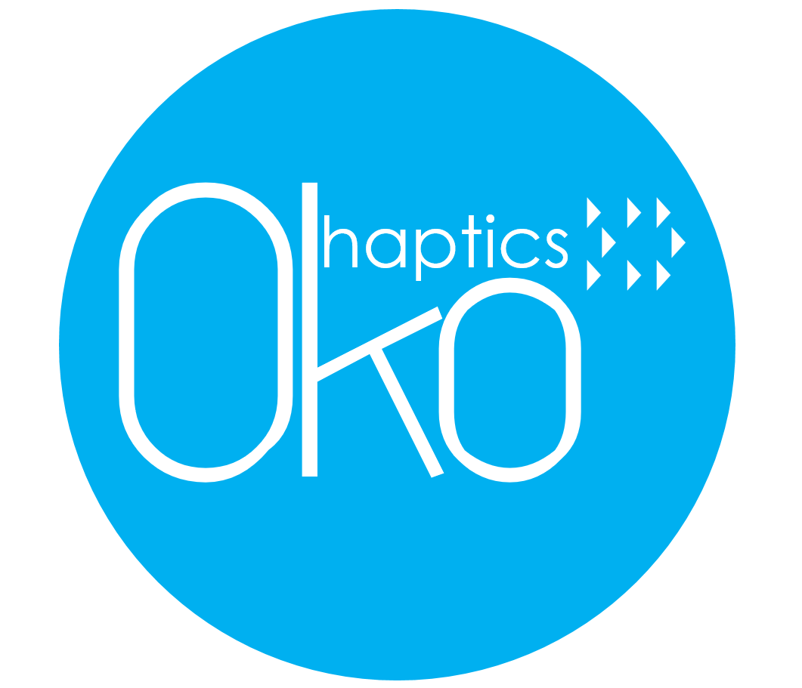

# 

## Oko Belt

This repo contains Arduino scripts deployed on the Oko Haptics belt.

The belt is intended to serve as an HCI communication platform between the user and the Oko Headsup Sensor. Functions include using the ESP8266 WiFi module to setup a WiFi sever. Receiving vibration intensity information from the Raspberry Pi on the headsup sensor and driving 21 haptic motors using the PCA9685 PWM Servo Driver.

